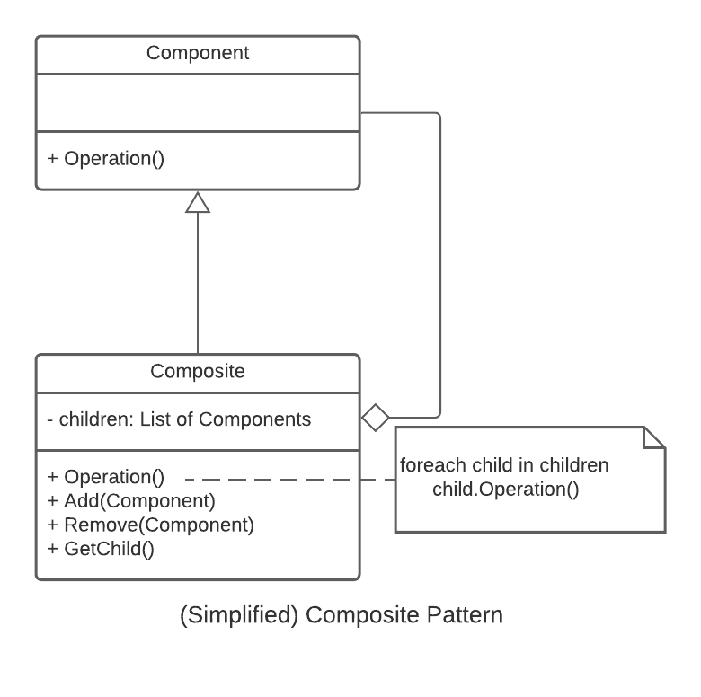
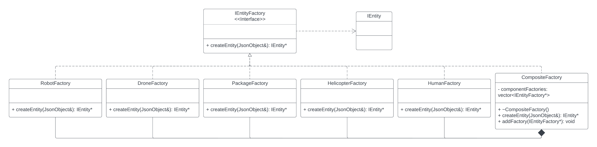

# 3081 Lab 7: Composite Factory Design Pattern
_(Due: Thursday, March 14th, 2024 @ 11:59pm)_

## Accessing a Lab Machine

For this assignment, you should make sure you are using our shared CSE development environment.  As such, you should use a lab machine in ***Keller Hall 1-250*** or ***Keller Hall 1-262*** ([details](https://cse.umn.edu/cseit/classrooms-labs#cselabs)).  If you do not have physical access to one of the lab computers, you can also access a lab machine remotely using [SSH](https://github.umn.edu/umn-csci-3081-s24/FAQ/blob/main/SSH/README.md) or a web-based service called [VOLE](https://github.umn.edu/umn-csci-3081-s24/FAQ/blob/main/VOLE/README.md). If using VOLE, be sure to use VOLE-FX3 for full compatibility.  You will use your CSE Labs account to login to the lab machines. If you do not already have an account, create the account following these [instructions](https://wwws.cs.umn.edu/account-management).


**IMPORTANT: Inside the lab machine, only files saved to your home folder (e.g., `/home/lorim007`) will persist across sessions. If you log out, make sure your progress is pushed to GitHub or saved in the home folder.**

## Retrieve Class Materials

1. Clone your team's repository for the lab.  This will require your section number and your team number.  If you need a reminder of your team number, check the announcements on Canvas for the project groups that were released.  You will be able to view the master list of groups with their associated numbers. **Replace the `sectionID` with your lecture section and `teamNumber` with your team number x500.**.
	```bash
	git clone git@github.umn.edu:umn-csci-3081-s24/team-sectionID-teamNumber.git
	```
	Example: If you're team-020-77, your command would be...
	```bash
	git clone git@github.umn.edu:umn-csci-3081-s24/team-020-77-lab07.git
	```
## What's in the lab07 folder?

<ul>
	<li>  <code>README.md</code>: You're reading this right now.
	<li>  <code>.gitignore</code>
	<li>  <code>dependencies</code>: A folder that contains external tools and libraries to compile and run the project.
	<li>  <code>docs</code>: Documentation files
	<li>  <code>service</code>: A folder with base code.  This contains:
		<ul>
			<li>  <code>include</code>: Header files
			<li>  <code>src</code>: Source files
		</ul>
	<li>  <code>web</code>: Front-end files
</ul>

## What You Will Do

1. Create factory classes for the creation of entities
1. Create a composite factory class 
1. Refactor entity creation to use a composite factory


# Task 0 is Required! Git Branch & Pull Requests

## Base Code Double Check ##
All base code given in labs will compile and run on machines specified in the [accessing a lab machine](#accessing-a-lab-machine) section. You should verify this by building and running the base code before you start the lab. If this code does not build and run on the given machines, please contact a teaching assistant.

## Collaborative Group Work

This lab marks a significant departure from traditional individual assignments as it introduces collaborative group work. Embracing a team-based approach fosters a collaborative environment where you and your team can leverage each other's strengths, share insights, and learn from one another. This not only enhances the learning experience but also reflects real-world scenarios where software development often involves teamwork and collaboration.

## Importance of Setting Expectations

Setting clear expectations early in the lab is paramount to its success. By outlining the objectives, scope, and guidelines, you and your team gain a shared understanding of what is expected of everyone. This clarity helps in aligning efforts, minimizing confusion, and ensuring that all team members are on the same page. Moreover, it promotes accountability and encourages proactive problem-solving, ultimately leading to a more productive and rewarding learning experience.

## GitHub Workflow and Branching
By leveraging GitHub's collaboration features and adopting a structured branching strategy, you and your team will gain hands-on experience in collaborative software development practices commonly employed in professional settings. This exposure not only enhances your technical skills but also cultivates essential teamwork and communication skills essential for success in the software industry.

### Repository Setup
A central repository is created on GitHub to host the project. Team members are granted access to the repository.

### Branching Strategy
Each team member works on a separate feature or aspect of the refactoring task. They create a new branch for their work, ensuring isolation and independence.

### Feature Implementation
Team members implement their assigned tasks within their respective branches, adhering to the refactoring guidelines and design principles.

### Pull Requests
Once a feature implementation is complete, team members create pull requests to merge their changes into the dev branch. Pull requests serve as a mechanism for code review and feedback.

### Code Review
Other team members review the code changes proposed in the pull requests, providing feedback, suggestions, and ensuring adherence to coding standards and design principles.

### Merge and Integration
After approval, the changes are merged from dev into the main branch, consolidating the work done by the team. Regular integration ensures that the project evolves cohesively and stays on track.


# Task 1 (Composite Factory Design Pattern)
## Concepts
### The Factory Pattern

The Factory pattern defines an interface for creating an object, but lets the subclasses decide which class to instantiate.  In other words, the Factory method lets a class defer instantiation to subclasses. Utilizing the Factory pattern allows you, the developer, to enforce SOLID principles.

There are two types of factories that you can create: an Abstract Factory or a Simple Factory (Factory Method). 

### Generic Simple Factory Application
This pattern should be used when you don’t know beforehand the exact types and dependencies of the objects your code should work with, when you want to provide users of your library or framework with a way to extend its internal components, or when you want to save system resources by reusing existing objects instead of rebuilding them each time. Usually, the Simple Factory only makes a few objects which cannot be categorized into distinct sets. 

### Generic Abstract Factory Application

This pattern should be used when your code needs to work with various families of related products, but you don’t want it to depend on the concrete classes of those products—they might be unknown beforehand or you simply want to allow for future extensibility.

### The Composite Pattern

The Composite pattern allows us to treat a group of objects as a single object. It additionally allows us to organize those objects as a hierarchy. 

In the Composite pattern, Component objects will be added to a Composite object (which implements the Component interface).

This can be helpful when there are operations that we want to perform on a group of the same type of objects. We would only need to perform the operation on the Composite object for the same result as performing that operation on all the composed Component objects. 
<br><br>
Example:

<p align="center">  </p>
<br>

More information on the Composite pattern can be found at [Refactoring.guru](https://refactoring.guru/design-patterns/composite)


### The Composite Factory

In the realm of software design, adhering to principles like SOLID is crucial for creating robust, maintainable, and extensible codebases. One common issue encountered in software development is the violation of the Open-Closed Principle (O) within the SOLID principles. This often occurs when code is littered with if-else blocks, making it hard to extend and maintain. In this lab, we will explore how to refactor such code using the Composite Factory pattern while ensuring adherence to SOLID principles.

Before delving into the solution, it's essential to understand the problem at hand. The presence of extensive if-else blocks in the codebase makes it rigid and prone to modification errors. This violates the Open-Closed Principle, which states that a class should be open for extension but closed for modification.

To address the issue of inflexible if-else blocks, we turn to the Composite Factory pattern. This pattern allows us to encapsulate multiple factory objects into a single composite factory. By doing so, we achieve a higher level of abstraction and flexibility in object creation.

#### Key Components of the Composite Factory
**Component:** This represents the abstract base class or interface for all factory objects.

**Leaf:** Concrete implementations of the Component interface, representing individual factory objects.

**Composite:** A container that can hold Leaf objects as well as other Composite objects, allowing for hierarchical organization of factories.

#### Benefits of Composite Factory
**Flexibility:** The Composite Factory allows for easy addition or removal of factory objects without modifying existing code.

**Scalability:** As the project grows, new factory objects can be seamlessly integrated into the Composite Factory structure.

**Readability:** By encapsulating creation logic, the code becomes more readable and maintainable.

#### Ensuring SOLID Principles
**Single Responsibility Principle (S):** Each factory object within the Composite Factory adheres to a single responsibility, focusing on the creation of a specific type of object.

**Open-Closed Principle (O):** The use of the Composite Factory ensures that the code is open for extension (adding new factory objects) but closed for modification (existing code remains untouched).

**Liskov Substitution Principle (L):** The Composite Factory maintains a consistent interface across all factory objects, allowing for seamless substitution of one factory object with another.

**Interface Segregation Principle (I):** By utilizing interfaces or abstract classes, we ensure that clients depend only on the interfaces they use, preventing unnecessary coupling.

Refactoring code to adhere to SOLID principles is essential for long-term maintainability and extensibility. By employing the Composite Factory pattern, we can effectively manage object creation logic while ensuring compliance with SOLID principles.


## Refactoring Process via Composite Factory Pattern

1. Setting up the system based on UML Class Diagram

	
	<p align="center">  </p>

	Create two new folders, both named `factory` in the corresponding simulationmodel directories.
	- `service/include/simulationmodel/factory`
	- `service/src/simulationmodel/factory`
	
	New files (remember that .h goes in include and .cc goes in src):
	- IEntityFactory.h _(Why no .cc?)_
	- CompositeFactory.h/.cc
	- PackageFactory.h/cc
	- DroneFactory.h/.cc
	- RobotFactory.h/.cc
	- HelicopterFactory.h/.cc
	- HumanFactory.h/.cc

1. Pick a Feature. Each member must have at least one feature if you’re in a group of 4. Each member must have at least two features if you’re in a group of 2.

	**Feature 1** - Development of IEntityFactory and Component Factories
	
	**IEntityFactory:** An interface factory class which all other factories will realize in order to be stored in a composite object.
	- `createEntity(JsonObject&): IEntity*` - Pure virtual function that must be overwritten in subsequent files for entity creation purposes.

	**Component Factories:** The component factories consist of the PackageFactory, DroneFactory, RobotFactory, HumanFactory, and HelicopterFactory.
	- `createEntity(JsonObject&): IEntity*` - Creates an entity if the JsonObject's type value matches the factory type, otherwise returns a nullptr. For example, in PackageFactory, you would create a package entity if the JsonObject's type value matches "package", otherwise returns a `nullptr`. The reason that we are doing it this way is because the CompositeFactory is going to iterate through its vector of Factories and call some function on it. What if it sends Drone details to the Package Factory? We don’t want the Package Factory to make a Package based on Drone details. Because of this, we have this additional logic.
	- Corresponding Doxygen documentation and Google Code Styling.


	**Feature 2** - Development of CompositeFactory
	
	**CompositeFactory**: A Factory and Composite class which is composed of `IEntityFactory` pointers. The composite factory can use these factories to create an entity of the corresponding type.
		
	- `createEntity(JsonObject&): IEntity*` - Iterates through its vector of factories and calls the `createEntity()` method for each. If the subfactory was able to create the entity, it shall return that newly created object, otherwise a `nullptr` if **all** subfactories return a nullptr. Notice that the component factories return `nullptr` if the type of the entity didn’t match the type of the factory.

	- `AddFactory(IEntityFactory*): void` - Adds the factory into the vector of `IEntityFactory` references.
	- Corresponding Doxygen documentation and Google Code Styling.


	**Feature 3** - Modifying SimulationModel
	- Add a private member variable to the SimulationModel class of type CompositeFactory.
	- Upon creation of a SimulationModel instance, the CompositeFactory shall have the following factories added to it.
		- DroneFactory
		- RobotFactory
		- PackageFactory
		- HelicopterFactory
		- HumanFactory
	- Refactor `SimulationModel::createEntity` method to use an instance of the CompositeFactory to create an entity rather than using the if-else block we updated in Lab06.
	- Corresponding Doxygen documentation and Google Code Styling.


	**Feature 4** - Informal Integration Testing
	- Once the other features have been completed, compile the project code and run the program and see if it works. For the following points, add a print statement that shows that functionality is working as expected. It is considered "working" if…
		- A drone spawns at startup
			- example test: print some drone details on the creation of a drone
		- The helicopter spawns at startup
		- The helicopter moves at startup
		- The Human spawns at startup
		- Robots are created when a delivery is scheduled
		- Packages are created when a delivery is scheduled

# Final Submission
**One submission per group. Designate someone to make the submission, then add members to the submission!**

Before submitting, make sure that...
- Your code compiles and runs from a clean directory.
   - `make clean; make -j`
- Appropriate Doxygen documentation is generated with `make docs`
- You have NO CPP lint errors from `make lint`
- Your teammates do a code review on your pull request into the dev branch.

To submit your lab:

1. Create a pull request from your team's development branch into your main branch.

   [FAQ: How to Create a Pull Request on Github](https://github.umn.edu/umn-csci-3081-s24/FAQ/tree/main/Github%20Pull%20Requests)


1. Get the latest commit ID from your development branch and submit it to the Gradescope assignment "Lab07: Composite Factory Design Pattern" with your team name. Only 1 group member should submit a gradescope assignment for the lab. Make sure that you add your teammates to the submission. See the FAQ link below on how to do this.  **DO NOT merge the pull request.**

   [FAQ: How to get a commit ID](https://github.umn.edu/umn-csci-3081-s24/FAQ/blob/main/Commit%20ID/README.md)

	 [FAQ: Gradescope Group Submissions](https://github.umn.edu/umn-csci-3081-s24/FAQ/blob/main/Gradescope%20Include%20Teammates/README.md)

Once you have done both steps above, you have completed the lab.


